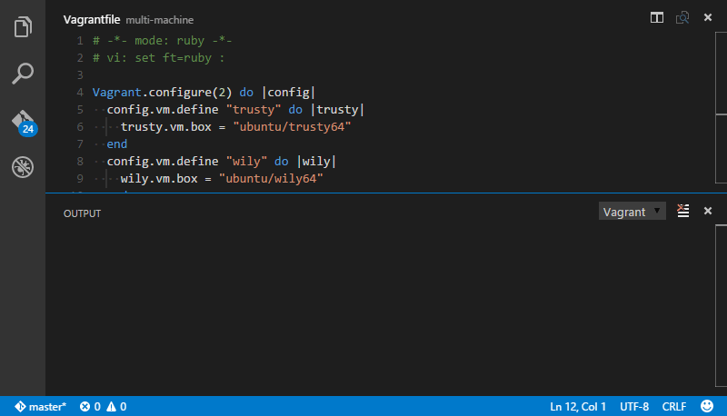
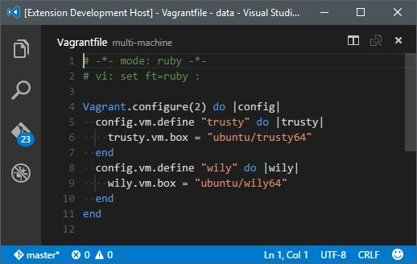

# [Vagrant](https://www.vagrantup.com/) support for [Visual Studio Code](https://code.visualstudio.com/)

## Features
### Vagrant machine management
The following Vagrant commands are currently supported:

| Name      | Vagrant Command      | VS Code Command               |
|-----------|----------------------|-------------------------------|
| Up        | `vagrant up`         | Vagrant: Start a machine.     |
| Provision | `vagrant provision`  | Vagrant: Provision a machine. |
| Suspend   | `vagrant suspend`    | Vagrant: Suspend a machine.   |
| Halt      | `vagrant halt`       | Vagrant: Halt a machine.      |
| Reload    | `vagrant reload`     | Vagrant: Reload a machine.    |
| Destroy   | `vagrant destroy -f` | Vagrant: Destroy a machine.   |

The extension automatically finds the `Vagrantfile` files within the workspace and will ask you on which machine to execute if they are multiple.

### Vagrantfile syntax coloring

## Installation
### Vagrant
No extra step is required. Simply make sure [Vagrant](https://www.vagrantup.com/) is still correctly installed and available in your `PATH` environment variable.

### Visual Studio Code
Hit `Ctrl+P` and enter the `ext install vagrant` command.

### Installing the extension locally
Just clone the [GitHub repository](https://github.com/bbenoist/vscode-vagrant) under your local extensions folder:
* Windows: `%USERPROFILE%\.vscode\extensions`
* Mac / Linux: `$HOME/.vscode/extensions`

## Issues / Feature requests
You can submit your issues and feature requests on the GitHub [issues page](https://github.com/bbenoist/vscode-nix/issues).

## More information
* [vscode-vagrant on the Visual Studio Marketplace](https://marketplace.visualstudio.com/items/bbenoist.Vagrant)
* [vscode-nix GitHub repository](https://github.com/bbenoist/vscode-vagrant)
* [Visual Studio Code website](http://code.visualstudio.com/)
* [Vagrant website](https://www.vagrantup.com/)
